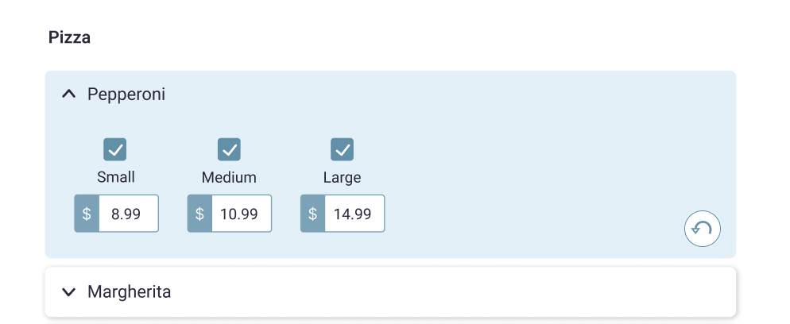

# PizzaMenu

This project was generated using [Angular CLI](https://github.com/angular/angular-cli) version 19.0.2.

# Description

The following design:

depicts a part of an online ordering menu.

- Imagine a Pizza menu category that has a few items, and each item has sizes and prices for each size
- Each item card on the design works **_like_** a [bootstrap accordion](https://getbootstrap.com/docs/5.0/components/accordion/)
- When you click on the item name the size/price section expands. At the same time the other item cards collapse
- When you uncheck a size, the related price is set to 0.00, and the input above is disabled
- User can edit the price (only numbers are allowed). Price changes **persist after page refresh**
- Each item card has an "Undo" button/function, which is **only displayed** if the user has made any changes to item since the app initialized. When clicked, the selected item's state reverts to the initial one (**what we had when the page first loaded**)

Given the data and their models:
[data.json](./json/data.json)

1. Create a new public repository in Github
2. Build a web app that matches the above design and functionality described above, using the available data
3. Send us the repo URL with your changes when you are ready

## Notes

- [x] 1. You can use any of the recent Angular versions (at least v15+)
- [x] 2. Avoid using any 3d-party dependencies, like state management tools, component frameworks, or CSS libraries. Write your own styles to match the mockup design
- [ ] 3. Try to make the app accessible based on the [WCAG 2.1 (AA) standards](https://www.w3.org/WAI/standards-guidelines/wcag/)
- [x] 4. You can import or copy the data from `data.ts` file any way you want |-> **converted to:**`data.json`
- [x] 5. You can use any of the available browser features/APIs to persist data between page reloads |-> **used `HttpClient` DI**
- [x] 6. The relations between the data use a classic relational approach (`id` based)
- [x] 7. The undo function is performed **per item** and should work for _any item list length_
- [x] 8. Try to use best practices as you would always do. Don't focus only on functionality or styling only

## Data Flow

### Component Responsibilities

#### `ItemsContainerComponent`

- subscibes to `ActivatedRouteFirstChild`
- subscribes to `ItemsService`
  - loads state
  - owns state
- handles navigation,
- dispatches actions,
- passes state to child,
- listens to child events

#### `ItemsListComponent`

- accepts `ItemState` via `@Input`,
- emits `selectedItem` via `@Output`,
- no state management,
- no dispatching,
- no router interaction
- passes `item` to `ItemCardComponent`
- listens for `selectedItem` form `ItemCardComponent`
- passes `item`,`isActive`,`cardState`

#### `ItemCardComponent`

- receives `itemState`
- emits `selectedItem`

#### `ItemDetailsComponent`
